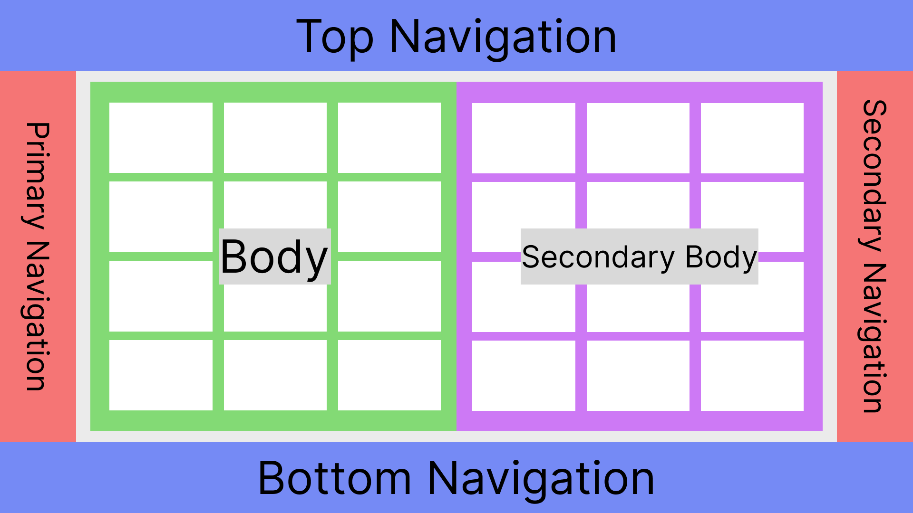
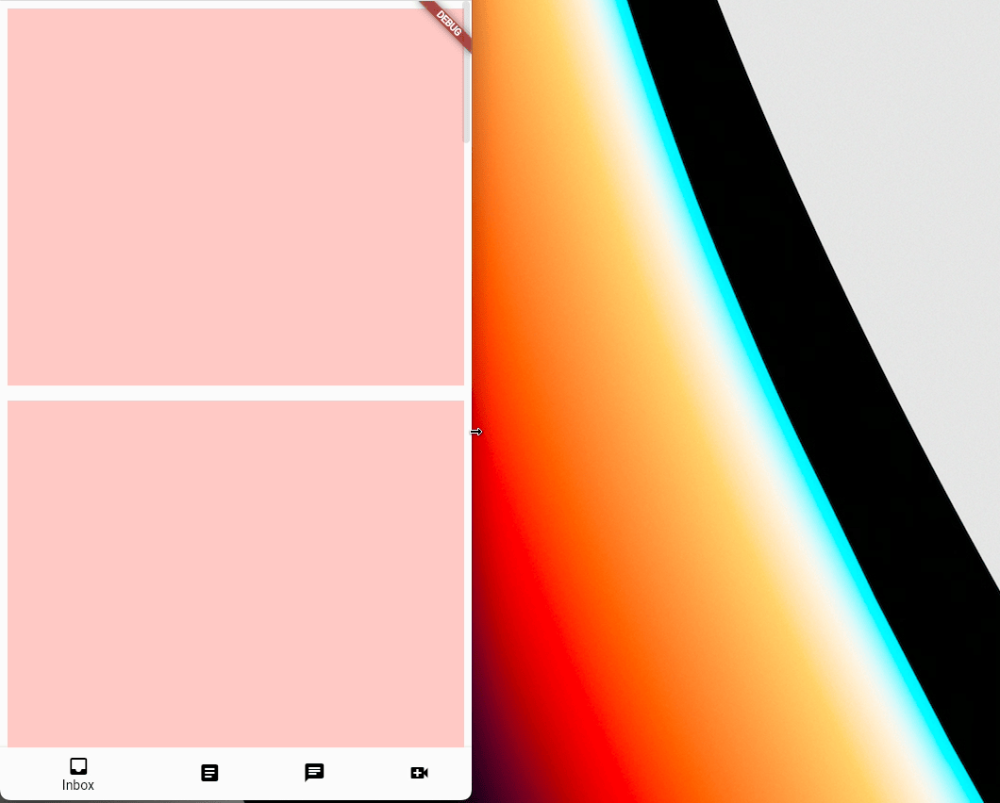

# Helper Widgets for Making Adaptive Layouts in Flutter (AdaptiveScaffold)

This package contains some helper widgets that make the process of developing adaptive layouts easier, especially with navigational elements.

To see examples of using these helper widgets to make a simple but common adaptive layout:

```bash
cd example/
flutter run --release
```
## AdaptiveScaffold:
AdaptiveScaffold implements the basic visual layout structure for Material Design 3 that adapts to a variety of screens. It provides a preset of layout, including positions and animations, by handling macro changes in navigational elements and bodies based on the current features of the screen, namely screen width and platform. For example, the navigational elements would be a BottomNavigationBar on a small mobile device and a NavigationRail on larger devices. The body is the primary screen that takes up the space left by the navigational elements. The secondaryBody acts as an option to split the space between two panes for purposes such as having a detail view. There is some automatic functionality with foldables to handle the split between panels properly. AdaptiveScaffold is much simpler to use but is not the best if you would like high customizability. Apps that would like more refined layout and/or animation should use AdaptiveLayout.
### Example Usage:

<?code-excerpt "adaptive_scaffold_demo.dart (AdaptiveScaffoldDemo)"?>
```dart
            AdaptiveScaffold(
                // An option to override the default breakpoints used for small, medium,
                // and large.
                smallBreakpoint: const WidthPlatformBreakpoint(end: 700),
                mediumBreakpoint:
                    const WidthPlatformBreakpoint(begin: 700, end: 1000),
                largeBreakpoint: const WidthPlatformBreakpoint(begin: 1000),
                useDrawer: false,
                destinations: const <NavigationDestination>[
                  NavigationDestination(
                      icon: Icon(Icons.inbox), label: 'Inbox'),
                  NavigationDestination(
                      icon: Icon(Icons.article), label: 'Articles'),
                  NavigationDestination(icon: Icon(Icons.chat), label: 'Chat'),
                  NavigationDestination(
                      icon: Icon(Icons.video_call), label: 'Video')
                ],
                body: (_) =>
                    GridView.count(crossAxisCount: 2, children: children),
                smallBody: (_) => ListView.builder(
                    itemCount: children.length,
                    itemBuilder: (_, int idx) => children[idx]),
                // Define a default secondaryBody.
                secondaryBody: (_) =>
                    Container(color: const Color.fromARGB(255, 234, 158, 192)),
                // Override the default secondaryBody during the smallBreakpoint to be
                // empty. Must use AdaptiveScaffold.emptyBuilder to ensure it is properly
                // overriden.
                smallSecondaryBody: AdaptiveScaffold.emptyBuilder)
```
## The Background Widget Suite
These are the set of widgets that are used on a lower level and offer more customizability at a cost of more lines of code.
#### AdaptiveLayout:

AdaptiveLayout is the top-level widget class that arranges the layout of the slots and their animation, similar to Scaffold. It takes in several LayoutSlots and returns an appropriate layout based on the diagram above. AdaptiveScaffold is built upon AdaptiveLayout internally but abstracts some of the complexity with presets based on the Material 3 Design specification.
#### SlotLayout:
SlotLayout handles the adaptivity or the changes between widgets at certain Breakpoints. It also holds the logic for animating between breakpoints. It takes SlotLayoutConfigs mapped to Breakpoints in a config and displays a widget based on that information.
#### SlotLayout.from:
SlotLayout.from creates a SlotLayoutConfig holds the actual widget to be displayed and the entrance animation and exit animation.
### Example Usage:

<?code-excerpt "adaptive_layout_demo.dart (AdaptiveLayoutDemo)"?>
```dart
  // Define the list of destinations to be used within the app.
    const List<NavigationDestination> destinations = <NavigationDestination>[
      NavigationDestination(
          label: 'Inbox', icon: Icon(Icons.inbox, color: Colors.black)),
      NavigationDestination(
          label: 'Articles',
          icon: Icon(Icons.article_outlined, color: Colors.black)),
      NavigationDestination(
          label: 'Chat',
          icon: Icon(Icons.chat_bubble_outline, color: Colors.black)),
      NavigationDestination(
          label: 'Video',
          icon: Icon(Icons.video_call_outlined, color: Colors.black)),
    ];

    // AdaptiveLayout has a number of slots that take SlotLayouts and these
    // SlotLayouts' configs take maps of Breakpoints to SlotLayoutConfigs.
    return AdaptiveLayout(
      // Primary navigation config has nothing from 0 to 600 dp screen width,
      // then an unextended NavigationRail with no labels and just icons then an
      // extended NavigationRail with both icons and labels.
      primaryNavigation: SlotLayout(
        config: <Breakpoint, SlotLayoutConfig>{
          Breakpoints.medium: SlotLayout.from(
            inAnimation: AdaptiveScaffold.leftOutIn,
            key: const Key('pnav1'),
            builder: (_) => AdaptiveScaffold.standardNavigationRail(
                leading: const Icon(Icons.menu),
                destinations: destinations
                    .map((_) => AdaptiveScaffold.toRailDestination(_))
                    .toList()),
          ),
          Breakpoints.large: SlotLayout.from(
            key: const Key('pn1'),
            inAnimation: AdaptiveScaffold.leftOutIn,
            builder: (_) => AdaptiveScaffold.standardNavigationRail(
              extended: true,
              leading: Row(
                mainAxisAlignment: MainAxisAlignment.spaceAround,
                children: const <Widget>[
                  Text('REPLY',
                      style:
                          TextStyle(color: Color.fromARGB(255, 255, 201, 197))),
                  Icon(Icons.menu_open)
                ],
              ),
              destinations: destinations
                  .map((_) => AdaptiveScaffold.toRailDestination(_))
                  .toList(),
              trailing: trailingNavRail,
            ),
          ),
        },
      ),
      // Body switches between a ListView and a GridView from small to medium
      // breakpoints and onwards.
      body: SlotLayout(
        config: <Breakpoint, SlotLayoutConfig>{
          Breakpoints.small: SlotLayout.from(
            key: const Key('body'),
            builder: (_) => ListView.builder(
              itemCount: children.length,
              itemBuilder: (BuildContext context, int index) => children[index],
            ),
          ),
          Breakpoints.mediumAndUp: SlotLayout.from(
            key: const Key('body1'),
            builder: (_) =>
                GridView.count(crossAxisCount: 2, children: children),
          )
        },
      ),
      // BottomNavigation is only active in small views defined as under 600 dp
      // width.
      bottomNavigation: SlotLayout(
        config: <Breakpoint, SlotLayoutConfig>{
          Breakpoints.small: SlotLayout.from(
            key: const Key('bn'),
            inAnimation: AdaptiveScaffold.bottomToTop,
            outAnimation: AdaptiveScaffold.topToBottom,
            builder: (_) => BottomNavigationBarTheme(
                data: const BottomNavigationBarThemeData(
                    selectedItemColor: Colors.black),
                child: AdaptiveScaffold.standardBottomNavigationBar(
                    destinations: destinations)),
          )
        },
      ),
    );
```
##
Both of the examples shown here produce the same output:


## Additional information
You can find more information on this package and its usage in the public [design doc](https://docs.google.com/document/d/1qhrpTWYs5f67X8v32NCCNTRMIjSrVHuaMEFAul-Q_Ms/edit?usp=sharing)
