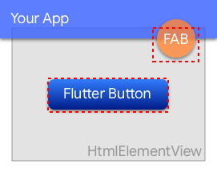
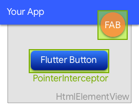

# web_pointer_interceptor

`PointerInterceptor` is a widget that prevents mouse events (in web) from being captured by an underlying [`HtmlElementView`](https://api.flutter.dev/flutter/widgets/HtmlElementView-class.html).

## What is the problem?

When overlaying Flutter widgets on top of `HtmlElementView` widgets that respond to mouse gestures (handle clicks, for example), the clicks will be consumed by the `HtmlElementView`, and not relayed to Flutter.

The result is that Flutter widget's `onTap` (and other) handlers won't fire as expected, but they'll affect the underlying webview.

<center>



_In the dashed areas, clicks won't work as expected._
</center>

## How does this work?

`PointerInterceptor` creates a platform view consisting of an empty HTML element. The element has the size of its `child` widget, and is inserted in the layer tree _behind_ its child in paint order.

This empty platform view doesn't do anything with mouse events, other than preventing them from reaching other platform views underneath it.

This gives an opportunity to the Flutter framework to handle the click, as expected:

<center>



_Each `PointerInterceptor` (green) renders between Flutter widgets and the underlying `HtmlElementView`. Clicks work as expected._
</center>


## How to use

Some common scenarios where this widget may come in handy:

* [FAB](https://api.flutter.dev/flutter/material/FloatingActionButton-class.html) unclickable in an app that renders a full-screen background Map
* Custom Play/Pause buttons on top of a video element don't work
* Drawer contents not interactive when it overlaps an iframe element
* ...

All the cases above have in common that they attempt to render Flutter widgets *on top* of platform views that handle pointer events.

There's two ways that the `PointerInterceptor` widget can be used to solve the problems above:

1. Wrapping your button element directly (FAB, Custom Play/Pause button...):

    ```dart
    PointerInterceptor(
      child: RaisedButton(...),
    )
    ```

2. As a root container for a "layout" element, wrapping a bunch of other elements (like a Drawer):

    ```dart
    Scaffold(
      ...
      drawer: PointerInterceptor(
        child: Drawer(
          child: ...
        ),
      ),
      ...
    )
    ```

### `debug`

The `PointerInterceptor` widget has a `debug` property, that will render it visibly on the screen (similar to the images above).

This may be useful to see what the widget is actually covering when used as a layout element.
